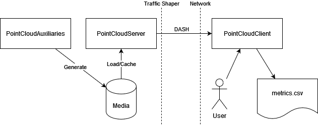

# Streaming.KOM
This projects aims to provide a point cloud streaming framework for quality of experience research. Each sub directory contains an individual part of the whole system. See the README files there for addtional info.

## Overview
This platform consists of three main parts, that are shown in Figure 1. First of all, we provide tools for voxelization, transcoding, merging and some other use cases in PointCloudAuxiliaries, with the purpose of preparing point clouds for streaming.

This media is then made available by the PointCloudServer for clients to stream over HTTP with DASH.

Lastly the actual client (PointCloudClient) is a project using the Unity Engine that can retrieve an MPD file from the server and then stream the media accordingly to it and the QoE policy implementation that is selected.

||
|-|
|*Figure 1: Overview of Streaming.KOM*|